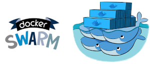

## Docker do zero ao Deploy

#### O que é Docker ?
O Docker é uma plataforma de código aberto que facilita a criação, execução e gerenciamento de aplicativos dentro de contêineres. Contêineres são ambientes leves e portáteis que encapsulam o código, bibliotecas e dependências necessárias para executar um software, garantindo que ele funcione de forma consistente em diferentes sistemas operacionais e infraestruturas.

Docker foi inicialmente criado por **Solomon Hykes** enquanto trabalhava em sua empresa chamada **dotCloud**, uma plataforma de Platform-as-a-Service (PaaS).

Foi lançado oficialmente como um projeto open-source em março de **2013**.

#### Marco Inicial - LXC (Linux Containers)
Docker começou como uma interface para LXC, uma implementação existente de contêineres no Linux. Em pouco tempo, evoluiu para usar seu próprio runtime de contêineres, tornando-se mais independente.

#### Crescimento e Adoção Rápida

 - Em 2014, a empresa dotCloud foi renomeada para Docker, Inc.

 - Em 2015, a Docker Inc. lançou o Docker Compose e o Docker Swarm.

 - Em 2017, o runtime do Docker foi doado para a Cloud Native Computing Foundation (CNCF) sob o nome containerd.

#### O que são Containers ?
Contêineres são unidades leves e portáteis que encapsulam um software junto com todas as suas dependências (bibliotecas, binários e configurações necessárias), permitindo que ele seja executado de forma consistente em qualquer ambiente. Eles compartilham o kernel do sistema operacional, tornando-os mais eficientes e rápidos que as máquinas virtuais, já que não precisam de um sistema operacional completo por contêiner.

#### O que é Efêmero
A palavra efêmero vem do grego ephemeros, que significa “duração de um dia”. 
No contexto geral, efêmero refere-se a algo que tem uma duração breve ou transitória, algo que existe apenas por um curto período de tempo.

#### Contêiner Efêmeros?

Um contêiner efêmero é aquele projetado para ter uma vida útil curta, ou seja, ele é criado para executar uma tarefa específica e ser descartado logo em seguida. Esse comportamento reflete um dos princípios fundamentais da computação em contêineres: impermanência.

#### Características dos Contêineres Efêmeros:
 
 - Não persistem dados
 - Escopo temporário
 - Foco na imutabilidade
 - Apoio à escalabilidade

#### Docker Registries
Um Docker Registry é um sistema que armazena, gerencia e distribui imagens de contêiner. Ele serve como um repositório centralizado para que desenvolvedores e equipes possam compartilhar, versionar e fazer deploy de imagens Docker de maneira eficiente.

##### Principais Funções de um Registry
 - Armazenamento de Imagens
 - Distribuição ( permite o download (pull) e permite o envio (push) )
 - Versionamento (v1.0, latest, etc.)
 - Automação (Integrações com pipelines CI/CD)
 - Segurança 

##### Registries Públicos
 - [Docker Hub](https://hub.docker.com/) 
 - [Quay.io](https://docs.quay.io/solution/getting-started.html)
 - [GitHub Container Registry](https://docs.github.com/en/packages/working-with-a-github-packages-registry/working-with-the-container-registry)

##### Registries Privados

 - [AWS ECR](https://docs.aws.amazon.com/pt_br/AmazonECR/latest/userguide/what-is-ecr.html)
 - [Azure ACR](https://azure.microsoft.com/pt-br/products/container-registry)
 - [Google Artifact Registry (GAR)](https://cloud.google.com/artifact-registry/docs?hl=pt-br)
 - [GitLab Container Registry](https://docs.gitlab.com/ee/user/packages/container_registry)
 - [DigitalOcean Registry](https://docs.digitalocean.com/products/container-registry/)
 - [Harbor](https://goharbor.io/)

###### Linguagem de Programação

O Docker é escrito principalmente em **Go**, a linguagem criada pelo **Google em medados de 2007** e lançada em 2009, foui escolhida devido sua eficiência, simplicidade e suporte nativo a concorrência.

#### Inspiração e Tecnologias de Base
Docker não inventou o conceito de contêineres, mas o tornou acessível e fácil de usar. Ele se baseia em tecnologias já existentes no Linux, como:

 - Namespaces que fornecem isolamento de processos.
 - Cgroups (Control Groups) que gerenciam recursos como CPU e memória.
 - UnionFS (Sistema de Arquivos em Camadas) que são usados para criar imagens imutáveis.

#### 2013 outras Ferramentas parecidas com Docker

 - **LXC (Linux Containers)** fornecia isolamento de contêineres usando namespaces e cgroups do Linux.
 - Foi uma das principais bases sobre as quais o Docker foi construído inicialmente.
 - OpenVZ (virtualização baseada em contêineres)
 - FreeBSD Jails 
 - Xen e KVM (Máquinas Virtuais)

#### Impacto no Mundo da Computação
 - Docker revolucionou a forma como desenvolvedores criam, distribuem e executam aplicações.
 - Ele se tornou um padrão na indústria de tecnologia, permitindo práticas modernas como CI/CD, DevOps e microsserviços.

#### Aquisição e Mudanças Recentes
 - Em 2021, a Mirantis adquiriu parte da Docker, Inc. A Docker agora foca em ferramentas para desenvolvedores enquanto a Mirantis oferece soluções corporativas.

#### Cultura de Comunidade
 - Como um projeto open-source, Docker é mantido por uma grande comunidade de desenvolvedores e contribuintes ao redor do mundo.
 - Hospeda eventos anuais, como o DockerCon, para conectar profissionais e promover o ecossistema.

#### Por que usar Docker?
 - Portabilidade: "Funciona na minha máquina" deixa de ser um problema.
 - Consistência: O ambiente de desenvolvimento é idêntico ao de produção.
 - Rapidez: Contêineres são leves e iniciam rapidamente.
 - Facilidade de Escalabilidade: Ideal para sistemas que precisam escalar horizontalmente.
 - Eficiência: Melhor utilização de recursos do sistema em comparação a VMs.

#### Cenários de Uso Comuns:
 - Hospedagem de microsserviços.
 - Desenvolvimento e teste local.
 - Continuous Integration/Continuous Deployment (CI/CD).
 - Execução de cargas de trabalho isoladas.

Aqui você irá encontrar mais detalhes de todo projeto. [Docker](https://www.docker.com/)

#### Ferramentas para orquestração usando Docker
 - [**Docker Swarm**](https://docs.docker.com/engine/swarm/)
 É o orquestrador nativo do Docker, integrado diretamente ao Docker Engine. O Swarm permite que você agrupe múltiplos nós (hosts) em um cluster, gerenciando-os como uma única entidade virtual. Com ele, é possível implantar serviços distribuídos, escalonar contêineres conforme a demanda e garantir alta disponibilidade. O Swarm é conhecido por sua facilidade de uso e integração direta com os comandos padrão do Docker, sendo uma opção adequada para ambientes menores ou para quem está iniciando na orquestração de contêineres

 - [**Docker Compose**](https://docs.docker.com/compose/)
 Embora não seja um orquestrador no sentido tradicional, o Docker Compose é uma ferramenta que facilita a definição e execução de aplicações multi-contêiner. Através de um arquivo YAML, você descreve os serviços que compõem sua aplicação, permitindo iniciá-los com um único comando. O Compose é amplamente utilizado em ambientes de desenvolvimento e testes, proporcionando uma maneira simples de gerenciar aplicações complexas em um único host.

*Além dessas ferramentas, é importante mencionar o [**Kubernetes**](https://kubernetes.io), uma plataforma de orquestração de contêineres de código aberto que se tornou padrão na indústria. Embora não tenha sido desenvolvida pela Docker Inc., o Kubernetes é compatível com o Docker e oferece recursos avançados de orquestração, sendo amplamente adotado em ambientes de produção.*

#### Ferramentas para monitoramento Docker

 - [Portainer](https://www.portainer.io/)
 Portainer é uma interface gráfica para gerenciamento de contêineres Docker, redes, volumes e imagens.
 
 - [Grafana](https://grafana.com/docs/grafana/latest/setup-grafana/installation/)
 Grafana é uma ferramenta de visualização de dados e monitoramento, popular por sua capacidade de criar dashboards personalizados.

 - [Prometheus](https://prometheus.io/docs/introduction/first_steps/)
 Prometheus é uma ferramenta de monitoramento e coleta de métricas focada em sistemas distribuídos.

 - [Docker Stats (comando)](https://docs.docker.com/reference/cli/docker/container/stats)
 Docker Stats é um comando CLI integrado ao Docker que exibe o uso de recursos dos contêineres em execução, como CPU, memória, E/S de disco e rede.

 - [LazyDocker (cli)](https://github.com/jesseduffield/lazydocker?tab=readme-ov-file)
  LazyDocker é uma ferramenta de linha de comando interativa, escrita em Go, que oferece uma interface simplificada para gerenciar contêineres, redes, volumes e logs.

 - [Dry (cli)](https://github.com/moncho/dry?tab=readme-ov-file)
 Dry é uma ferramenta CLI para monitorar e gerenciar contêineres, imagens e recursos Docker de forma prática e simplificada.

 - [Docker Desktop (Microsoft e Mac)](https://www.docker.com/products/docker-desktop)
 Docker Desktop é uma aplicação oficial da Docker Inc. para Windows e macOS e que oferece uma interface gráfica para gerenciar contêineres localmente.

 - [Rancher](https://www.rancher.com)
 Rancher é uma plataforma completa para gerenciar ambientes de contêineres, especialmente clusters Kubernetes.

